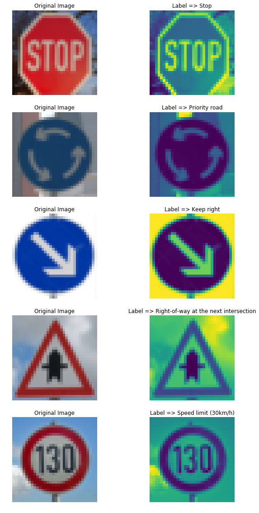
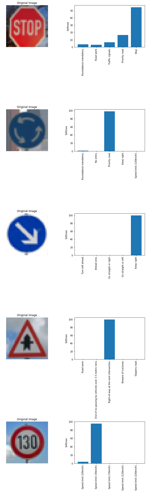

# **Traffic Sign Recognition** 

### Data Set Summary & Exploration
* The size of training set is 34799 samples
* The size of the validation set is 4410 samples
* The size of test set is 12630 samples
* The shape of a traffic sign image is (32, 32, 1)
* The number of unique classes/labels in the data set is 
 Train:`{0: 180, 1: 1980, 2: 2010, 3: 1260, 4: 1770, 5: 1650, 6: 360, 7: 1290, 8: 1260, 9: 1320, 10: 1800, 11: 1170, 12: 1890, 13: 1920, 14: 690, 15: 540, 16: 360, 17: 990, 18: 1080, 19: 180, 20: 300, 21: 270, 22: 330, 23: 450, 24: 240, 25: 1350, 26: 540, 27: 210, 28: 480, 29: 240, 30: 390, 31: 690, 32: 210, 33: 599, 34: 360, 35: 1080, 36: 330, 37: 180, 38: 1860, 39: 270, 40: 300, 41: 210, 42: 210}`
Test:`{0: 60, 1: 720, 2: 750, 3: 450, 4: 660, 5: 630, 6: 150, 7: 450, 8: 450, 9: 480, 10: 660, 11: 420, 12: 690, 13: 720, 14: 270, 15: 210, 16: 150, 17: 360, 18: 390, 19: 60, 20: 90, 21: 90, 22: 120, 23: 150, 24: 90, 25: 480, 26: 180, 27: 60, 28: 150, 29: 90, 30: 150, 31: 270, 32: 60, 33: 210, 34: 120, 35: 390, 36: 120, 37: 60, 38: 690, 39: 90, 40: 90, 41: 60, 42: 90}`
Validation:`{0: 30, 1: 240, 2: 240, 3: 150, 4: 210, 5: 210, 6: 60, 7: 150, 8: 150, 9: 150, 10: 210, 11: 150, 12: 210, 13: 240, 14: 90, 15: 90, 16: 60, 17: 120, 18: 120, 19: 30, 20: 60, 21: 60, 22: 60, 23: 60, 24: 30, 25: 150, 26: 60, 27: 30, 28: 60, 29: 30, 30: 60, 31: 90, 32: 30, 33: 90, 34: 60, 35: 120, 36: 60, 37: 30, 38: 210, 39: 30, 40: 60, 41: 30, 42: 30}`

---

### Image model
Each image comes into the processing pipline:
1. GrayScale (Pixel[i] . `0.299, 0.587, 0.114`)
2. Normalized ( ( GrayScalePixel[i] - 128. ) / 128 )

For the **Trainig Set** images I also add 5 rotation (`-30, -20, -10, 10, 20, 30`) of the images into the trainig set so the network can figure the rotation out. So my new training has **243593** (7 × 34799) samples

I use `scipy.ndimage.rotate` with `nearest` mode and then resize the result to `32x32` pixel.

---

### Network model
| Layer         		|     Description	        					| 
|:---------------------:|:---------------------------------------------:| 
| Input         		| 32x32x1 RGB image   							| 
| Convolution 5x5     	| 1x1 stride, same padding, outputs 28x28x8 	|
| RELU					|												|
| Max pooling	      	| 2x2 stride, 2x2 kernel, outputs 14x14x8
| Convolution 5x5	    | 1x1 stride, same padding, outputs 10x10x16 |
| RELU					|												|
| * Max pooling	      	| 2x2 stride, 2x2 kernel, outputs 5x5x16 |
| Convolution 7x7	    | 1x1 stride, same padding, outputs 8x8x16 |
| RELU					|												|
| * Max pooling	      	| 2x2 stride, 4x4 kernel, outputs 5x5x16 |
| Inception Module 	      	| Combination of two * Max poolings, output = 5x5x32|
| Convolution 1x1 	      	| 1x1 stride, output = 5x5x32|
| Flatten		| First fully connected - 5x5x32 to 800|
| Dropout		|  |
| Fully Connected - RELU		| input = 800,  output = 400|
| Fully Connected - RELU		| input = 400,  output = 120|
| Dropout		|  |
| Fully Connected - RELU		| input = 120,  output = 86|
| Fully Connected - RELU		| input = 43,  output = 43|

---

### Training
I use softmax corss entropy method with AdamOptimizer try to minimize the mean of error. 

* EPOCHS = 11
* BATCH_SIZE = 128
* LEARNING_RATE = 0.001
* KEEP_PROB = 0.5

Training Result:
>Training...
EPOCH 1 Validation Accuracy = 86.42%
EPOCH 2 Validation Accuracy = 90.79%
EPOCH 3 Validation Accuracy = 93.06%
EPOCH 4 Validation Accuracy = 93.15%
EPOCH 5 Validation Accuracy = 94.08%
EPOCH 6 Validation Accuracy = 93.92%
EPOCH 7 Validation Accuracy = 94.06%
EPOCH 8 Validation Accuracy = 94.74%
EPOCH 9 Validation Accuracy = 94.76%
EPOCH 10 Validation Accuracy = 94.69%
Model saved

Test Result:
>INFO:tensorflow:Restoring parameters from ./network
Test Accuracy = 94.44%

---

### Internet Images:
I've downloaded 5 images from internet and test network with them. The accuracy was 40%. One problem was there were no `Speed limit (130 km/h)` in the training examples and the result was the closest gauss (I think!)

And the softmax result result is here:

